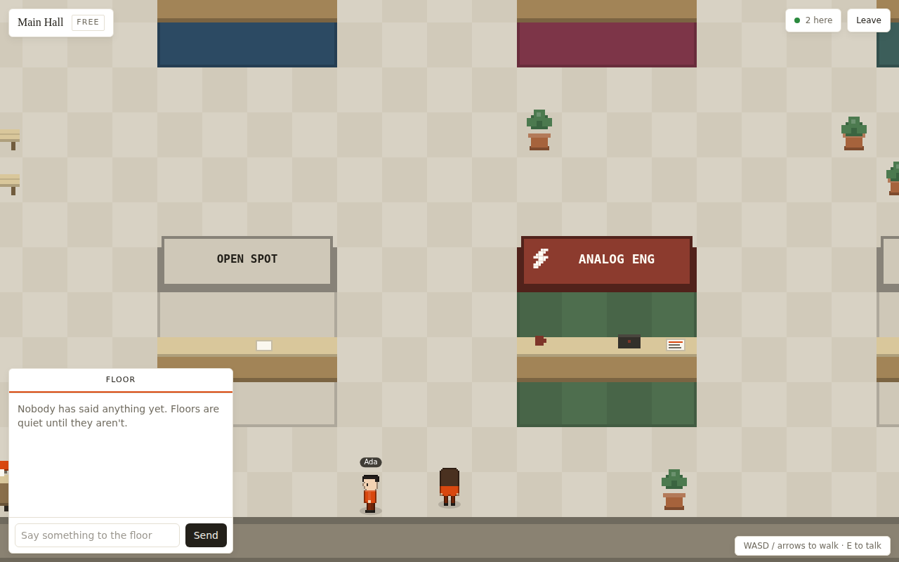

# FounderFloor

A walkable 2D expo floor for startups. Each floor is a small tile-map hall with
booths; founder NPCs stand at their booths, mutter in-voice idle lines, and
answer keyword-matched questions in DMs. Other visitors show up as live avatars
over WebSocket — you can watch them talk in speech bubbles, click one to DM
them, and sign the guestbook at their stand. Ranks hang on verified monthly
revenue, not vibes. Next.js 14 (app router) on the front, a plain `ws` room
server on the back, canvas 2D for the world — no game engine, no sprite assets,
everything is drawn procedurally at init.



## Quickstart

```bash
npm install
npm run dev
```

Two ports: the web app on **http://localhost:3000** and the floor server
(WebSocket + HTTP) on **:3001** (`PORT_WS` overrides it). `npm run dev` starts
both via concurrently; `npm run dev:web` / `npm run dev:ws` start them
separately. `npm run typecheck` and `npm run build` do what they say.

If the floor server is down the game still runs — you get a "solo preview"
badge and NPC founders only.

## Controls

- **WASD / arrow keys** — walk; **click/tap anywhere** — pathfind there
  (clicking a booth from across the hall walks you up to it; on touch this is
  the only way to get around, and it's fine)
- **E or Enter** — talk to the booth you're near (a `!` bubble and an "E — talk
  to" hint appear); clicking a nearby booth works too
- **1–8** — reactions; they pop as a bubble over your head for everyone on the
  floor. The bar at the bottom does the same thing with a mouse or a thumb.
  1–5 (wave, laugh, clap, heart, question) are always available; 6–8
  (rocket, fire, handshake) are quest rewards. Every reaction is our own
  hand-drawn 10x10 pixel bitmap (game/emotes.ts) rendered in the same palette
  as the avatars and booths — no OS emoji font anywhere in the world
- **?** (bottom right) — controls reference; the floor stays quiet otherwise:
  chat starts folded into a one-line bar (with the activity ticker in its
  header) and only unfolds when a conversation opens
- **M** — toggle the minimap (bottom right; on by default when the hall is
  bigger than your screen)
- **Hover** a booth, founder, or player for a card with the one-liner, rank,
  and status; **click a player** to open a DM with them
- Chat panel (bottom left): **Floor** tab broadcasts to everyone on the floor
  (and renders as a bubble over your avatar); other tabs are DM threads — NPC
  founders or live players. Unread dots mean what unread dots always mean
- **Walking away from a booth closes its card and conversation** — like a real
  expo, the chat doesn't follow you across the hall
- Typing in any input suspends movement keys

## Tutorial, quests and rewards

First visit gets a five-step guided tour (walk → find a booth → talk → react →
connect), one instruction at a time, skippable. After that the quest tracker
(top left) is the "what should I do?" surface: seven quests — talk to three
founders, make three connections, sign two guestbooks, claim a stand, visit
two floors, send ten reactions — each rewarding a badge, and some unlocking
the three bonus reactions or an earnable **title** ("Connector", "Exhibitor",
"Socialite") you can pick in Profile; titles show on your hover card so other
players see them. Progress lives in localStorage with everything else, and
none of it gates the social basics — chat, connecting and claiming stay free
for everyone.

## Liveness

- **Speech bubbles** — floor chat renders above the speaker's avatar; emotes
  pop in a small circle. NPC founders have ambient chatter of their own, so a
  floor with nobody on it still sounds like a floor.
- **Player-to-player DMs** — click a live avatar (or get clicked) and a DM
  thread opens in the chat panel, relayed through the floor server. You can
  "Connect" from the thread header, same as with a founder.
- **Guestbooks** — every booth card has one. Sign it and the entry lands on
  the server, broadcasts to the floor, and is still there tomorrow.
- **Activity ticker** — one muted line under the top bar cycling recent floor
  events: who walked in, who set up a stand, who signed a guestbook.
- **Status line** — set "raising seed" (or whatever) in Profile; it shows
  under your name label on the floor and in your hover card.
- **Onboarding checklist** — four first-session steps (walk, talk, react,
  connect). Finishing them earns the First Steps badge.
- **Badges** — shown on /profile. First Steps for the checklist, Demo Night
  for being in the hall while the event is live. Earned, not requested.
- **Demo Night** — every Thursday 19:00–20:00 UTC on the Main Hall. The pill
  in the lobby and the floor HUD counts down to it.
- **/directory** — all seed startups across all floors on one page: text
  search, category / seeking-co-founder / minimum-rank filters, live "N here"
  presence dots, and a "Walk there" link per row. The lobby shows the same
  presence counts per floor.

## Claiming a stand

Every floor has OPEN SPOT stands. Set up your startup in Profile (name, pitch,
carpet/banner colors, sign, glyph, carpet pattern — with a pixel-accurate live
preview), then walk up to any open stand and press **E** → **Claim this
stand**. Your booth goes up on the spot, with a gold owner stripe, and every
player on the floor sees it live over the WebSocket (first claim wins; the
server arbitrates ties). One stand per floor; claiming another spot moves your
stand; "Pack up" from your own stand card takes it down.

**Stands persist while you're away.** When you leave the floor your stand stays
up, server-side, marked with a gray "away" lamp on the banner (green while
you're on the floor) — visitors can still read your pitch, connect, and leave
guestbook notes, which is the whole point of an expo stand. It comes back
online the moment you return, and expires after 7 days without a visit.
Packing up (or taking down your startup in Profile) removes it everywhere.

## Connections (mutual) and off-floor chat

Connecting with a real person is a **request**, not a click: they see your
calling card — name, title, status, badges, connection count, your startup and
its rank, floors visited — and accept or decline (on the floor as a popup if
they're online, otherwise in their inbox). Two people who request each other
auto-connect. Accepted connections live server-side and appear on
**/connections**, where chat keeps working even when neither of you is on a
floor. Delivery is **live**: DMs are pushed over WebSocket to both parties
wherever they are — someone texting you from their Connections screen pops up
as a toast and a chat thread on whatever floor you're walking (the Connections
page keeps a lightweight socket to an invisible "__inbox" room; polling is
just the fallback). Messages persist in floor-data.json. The nav link carries
an unread dot. NPC founders still connect instantly — they're exhibits, not
people.

New endpoints: `GET /social?me=ID[&token=..]`, `POST /social/request|respond|dm`.

## Accounts

Optional, no email required, never a wall — guests keep full access. Create an
account in Profile (name + password; scrypt-salted hashes and bearer tokens on
the floor server, persisted in floor-data.json). What it buys you: your
identity is **server-verified** — a ws join or social call claiming an account
id without its token is downgraded to an anonymous guest, so nobody can
impersonate you, squat your stand, or read your inbox — and because the social
graph is keyed by the account id, your connections and chats follow you to any
device you sign in on. Quests, badges, and your booth design still live per
browser (that sync is future work). Endpoints:
`POST /auth/register|login|logout` (rate-limited per IP).

## Moderation

In any player DM thread: **Mute** hides that person's floor chat, DMs, bubbles
and emotes for you (session-scoped); **Report** files a rate-limited report the
operator can review in `server/floor-data.json` under `reports`. Neither is
visible to the other person.

## Floor server HTTP

The `ws` server also answers plain HTTP on the same port (CORS `*`):

| Route | Returns |
| --- | --- |
| `GET /presence` | `{ floors: { [floorId]: liveCount } }` — who's where, right now |
| `GET /guestbook?floor=ID&key=KEY` | `{ entries: GuestbookEntry[] }` — newest first, capped at 50. `key` is the startup id for seed booths, `spot:<index>` for claimed stands |

Guestbooks and the activity ticker persist to `server/floor-data.json`
(debounced 2s, atomic tmp+rename write; flushed on SIGINT/SIGTERM; a corrupt
file gets you one warning and an empty start). Rooms, positions, and chat are
in-memory only and vanish on restart.

## Architecture

| Path | Owns |
| --- | --- |
| `lib/types.ts` | Every shared contract. All modules compile against this file; it imports nothing. |
| `lib/data/floors.ts` | The four floor definitions: tile size, theme, 4x3 booth spots (+1-tile apron), tier gates, the reserved spot for your booth. |
| `lib/data/startups.ts` | 25 seed startups with booth themes, keyword-matched dialogue (`replyFor()`), and per-founder ambient idle lines (`IDLE_LINES`). |
| `lib/data/events.ts` | The weekly Demo Night window, computed in pure UTC math. |
| `lib/ranks.ts` | Revenue → rank table (`Garage` … `Escape Velocity`). |
| `lib/store.ts` | SSR-safe localStorage store (`useAppState`): profile (+status), tier, connections (+notes), your startup, claims, onboarding steps, badges. |
| `lib/net.ts` | Browser WebSocket client implementing `NetClient`, plus `httpBase()` for the HTTP routes; silently degrades to offline single-player, 2 reconnect attempts on drops. |
| `server/index.mjs` | Standalone `ws` + HTTP floor server: rooms keyed by floor id, join/move/chat/emote/booth/guestbook relay, rate limiting, heartbeat, JSON persistence. |
| `game/engine.ts` | Render loop, input, collision, camera, movement packets, remote-player interpolation, booth proximity, hover hit-tests, tap-to-walk, minimap, bubble plumbing. |
| `game/path.ts` | BFS tile pathfinding for click/tap-to-walk (solid targets resolve to the nearest reachable tile). |
| `game/bubbles.ts` | Chat/emote bubble rendering: one live bubble per entity, word wrap, fades. |
| `game/tilemap.ts` | FloorDef → collision grid + draw lists: walls, checker floor, booth stalls, seeded ambient props. |
| `game/sprites.ts` | Procedural pixel avatars (skin/outfit/hair palettes), booth glyphs, color utilities. |
| `game/npc.ts` | Founder NPCs (fidget near their counter, face you when you approach) and the AmbientDirector that schedules idle chatter, neighbor reactions, and wave-backs. |
| `app/` | Routes: landing, `/lobby` (floor picker + presence + first-visit onboarding), `/floor/[id]` (the game + HUD), `/directory` (search + filters), `/profile` (identity, status, booth editor, verification, membership, badges, connections). |
| `components/` | HUD and form pieces: BoothCard, ChatPanel, Guestbook, HoverCard, EmoteBar, ActivityTicker, OnboardingCard, EventPill, AvatarPicker, RankBadge, TierTag, Toast, `usePresence`. |

## Demo simplifications (and the production path)

- **In-memory rooms** — the ws server keeps rooms in a `Map` and forgets
  positions and chat on restart (guestbooks and the ticker survive via
  `floor-data.json`); production would move room state to Redis pub/sub so
  multiple server nodes share floors and survive deploys.
- **localStorage persistence** — profile, connections, tier, badges and your
  booth live under one localStorage key on the device; production would keep
  profiles in Postgres behind real accounts.
- **Simulated revenue verification** — the profile page lets you type a
  number and calls it verified; production is read-only revenue verification
  via Stripe Connect, so the rank badge reflects charges Stripe actually saw.
- **Simulated subscriptions** — the tier switcher just writes to the store;
  production would put Pro/Founder+ on Stripe Billing and gate floors off the
  subscription status webhook.

## What to build next

- Persist floor chat history per room (currently vanishes on leave).
- Spatial audio-style chat fading by distance, since positions already relay.
- Booth analytics for owners: visits, chats, connects, guestbook rate.
- Moderation basics before any of this meets the public internet: name
  filtering, mute, report — the guestbooks especially.
